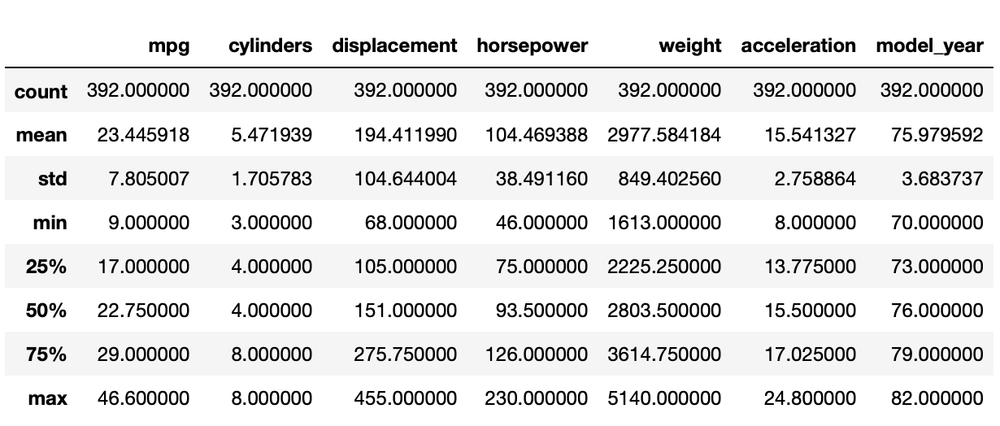
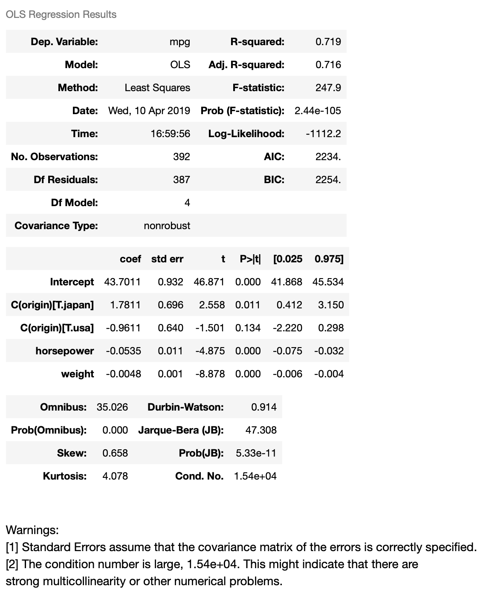

## Fitting Data to a Model

With data points available for certain values, we can build a more general predictive model using linear regression.  What we'll do is fit a linear response to each variable from a data set; in fancy terms,

$$
y = \beta_0 + \beta_1 x_1 + \beta_2 x_2 + ... + \beta_n x_n
$$

for $n$ values.  A linear regression model makes a few key assumptions:

1.  Features are linearly independent of each other.
2.  Errors in the regression are normally distributed (rather than biased).
3.  Effects are linear functions of inputs.

The model $y$ is an _effect_ or _response_ produced by the _features_, the _predictors_, or the _values_ (all meaning more or less the same thing to us).  If only one feature $x_1$ is used, this is a simple linear regression; if more than one feature is used, as above, then this is a multiple linear regression.

Linear regression is actually implemented several times in Python libraries.  We will use the Python library `statsmodels` to construct a regression model over a fuel efficiency dataset, which can be loaded from Seaborn with the `load_dataset()` function.  We would like to build a regression model to predict an automobile's fuel efficiency (in mpg or miles per gallon) from vehicle features.

First, we load and clean the data.

```python
import seaborn as sns
mpg = sns.load_dataset("mpg")

# Display first few rows
mpg.head(5)
```

{:height="150px"}

Load and examine the data set:

```python
mpg.info()
```

> ```python
> <class 'pandas.core.frame.DataFrame'>
> RangeIndex: 398 entries, 0 to 397
> Data columns (total 9 columns):
> mpg             398 non-null float64
> cylinders       398 non-null int64
> displacement    398 non-null float64
> horsepower      392 non-null float64
> weight          398 non-null int64
> acceleration    398 non-null float64
> model_year      398 non-null int64
> origin          398 non-null object
> name            398 non-null object
> dtypes: float64(4), int64(3), object(2)
> memory usage: 28.1+ KB
> ```
{: .output}

The dataset has nine columns, with self-explanatory titles.  There are 398 rows in the dataset.  One column, `horsepower`, has 6 missing values.  We focus on linear regression in this lesson so we simply drop the rows with missing values to get a clean dataset.  (This is by no means the best approach since we will lose valuable data points.  One alternative is estimating horsepower by other factors, ie. displacement and acceleration.)

```python
#simply drop missing values
mpg.dropna(inplace=True)
mpg.info()
```

> ```python
> <class 'pandas.core.frame.DataFrame'>
> Int64Index: 392 entries, 0 to 397
> Data columns (total 9 columns):
> mpg             392 non-null float64
> cylinders       392 non-null int64
> displacement    392 non-null float64
> horsepower      392 non-null float64
> weight          392 non-null int64
> acceleration    392 non-null float64
> model_year      392 non-null int64
> origin          392 non-null object
> name            392 non-null object
> dtypes: float64(4), int64(3), object(2)
> memory usage: 30.6+ KB
> ```
{: .output}

### Descriptive Statistics

Our next step is to compute the basic descriptive statistics for the features in this data set.  To accomplish this, we can use the `.describe()` function of the `DataFrame`.

```python
mpg.describe()
```

{:height="250px"}

### Regression Model

With a clean dataset and a cursory understanding of the basic statistics, we are ready to build a model to predict fuel efficiency.  The dependent variable (or _response_) will be `mpg`.  We need to pick a set of candidate dependent variables from the other eight columns.

There are two types of variables in the dataset, *categorical* and *continuous*:

- Categorical Variables:  the value is limited and usually based on a particular finite group.  E.g., `origin`.
- Continuous Variables:  numeric variables that have an infinite number of gradations between any two values. E.g., `horsepower`.

In a regression model, dependent variables must be continuous.  We don't have a really great way to handle categorical dependent variables except to create dummy variables for them.  Taking `origin` in this dataset as an example, there are three unique values:

```python
mpg.origin.unique()
```

> ~~~
> array(['usa', 'japan', 'europe'], dtype=object)
> ~~~
> {: .output}

To create dummy variables for `origin`, we can add two new columns to the dataset, say `origin_usa` and `origin_japan`.

- If `origin` is `usa`, `origin_usa=1` and `origin_japan=0`;
- If `origin` is `japan`, `origin_usa=0` and `origin_japan=1`;
- If `origin` is `europe`, `origin_usa=0` and `origin_japan=0`.

(Even though there are three distinct values, we only need two dummy columns to cover all the cases.)

`statsmodels` provides a way to automatically create dummy variables for categorical variables, so we don't have to do it manually.

For this regression, `mpg` will be the dependent variable.  Let's choose `horsepower`, `weight` and `origin` for the independent variables.  Among these, `origin` is a categorical variable while the other two are continuous.  (Criteria for selecting independent variables can become very complicated.)

To construct the regression model, we define a string-formula using column names (column names can't have whitespaces).  For this dataset and the variables we chose, the formula is defined as:

```python
mpg ~ horsepower + weight + C(origin)
```

`C(origin)` indicates that `origin` is a categorical variable.

We next construct the model using the string formula and the dataset, then fit the model, and display the summary of the regression result.

```python
import statsmodels.formula.api as smf

formula = 'mpg ~ horsepower + weight + C(origin)'
model = smf.ols(formula, data=mpg)
result = model.fit()

result.summary()
```

{:height="650px"}

### Interpreting Regression Results

The resulting tables shows the dependent variable, the model, and the method.  OLS stands for [Ordinary Least Squares](http://setosa.io/ev/ordinary-least-squares-regression/), meaning that we’re trying to fit a model that minimizes the square of distance of each point from the model regression line.

This model has an $R^2$ value of 0.719, meaning that 71.9% of the variance in our dependent variable (`mpg`) can be explained by this model.

Based on the coefficient values, we can construct the regression equation:

```python
mpg = 43.7 - 0.0535 horsepower - 0.0048 weight + 1.7811 origin.japan - 0.9611 origin.usa
```

This reads:

1. If `horsepower` increases by 1, `mpg` will decrease by 0.0535.
2. If `weight` increases by 1 pound, `mpg` will decrease by 0.0048.
3. If the `origin` is Japan, `mpg` will increase by 1.7811 (compared to European cars).
4. If the `origin` is USA, `mpg` will decrease by 0.9611 (compared to European cars).

For an European car, `origin.japan=0` and `origin.usa=0`, yielding the equation:

```python
mpg = 43.7 - 0.0535 horsepower - 0.0048 weight
```

This means that the impact of `origin` has already been incorporated in the $y$-intercept.  This explains why the impact of `origin.japan` and `origin.usa` is on top of European cars.

So far, so good:  we have a model that can predict automotive gas mileage using `horsepower`, `weight`, and `origin` to a certain extent ($R^2=0.719$).  But looking into the coefficient table further, we can see some statistical information which illuminates what's going on.  In particular, *$t$ scores* and *$p$ values* ($p>|t|$) provide support for a hypothesis test.  $|t|>2$ or $p<0.05$ indicates that a coefficient is statistically significant (at 95% confidence).  The coefficient of `origin.usa` has a $p$ value of 0.134, which means it's not statistically significant, or at least that we can't reject the null hypothesis that the coefficient is 0 (at 95% confidence).  This is also indicated by the 95% confidence interval of the coefficient, -2.220 to 0.298, which includes 0.  Based on the $p$-value, we can say that Japanese cars are more efficient than European cars holding horsepower and weight constant, but we can't say the same thing for American cars at 95% confidence level.

### Is `model_year` categorical or continuous?

Fuel efficiency generally improves over time, so it make sense to consider `model_year` in the regression model as independent variable. The `model_year` column contains numeric values, we can add it as a continuous variable. The formula then looks like this:

```python
mpg ~ horsepower + weight + C(origin) + model_year
```

However, this model assumes that fuel efficiency changes linearly over time, which is not obviously true.  It is, in fact, better to add `model_year` into the regression model as a categorical feature, leadind to the following formula:

```python
mpg ~ horsepower + weight + C(origin) + C(model_year)
```

We will compare these two models:

```python
formula = 'mpg ~ horsepower + weight + C(origin) + model_year'
model = smf.ols(formula, data=mpg)
result = model.fit()
result.summary()
```

{:height="550px"}

We can see that adding `model_year` to the model increases $R^2$ from 0.719 to 0.819.  The coefficient of `model_year` is 0.7544, which means `mpg` increases by 0.7544 each year.  The coefficient is also statistically significant.  Let's see what we get when we add `model_year` to the regression model as a categorical variable.

```python
formula = 'mpg ~ horsepower + weight + C(origin) + C(model_year)'
model = smf.ols(formula, data=mpg)
result = model.fit()
result.summary()
```

{:height="850px"}

The new model has $R^2 = 0.852$.  Looking into the coefficients of dummy variables of `model_year`, we can see that from 1971 to 1976, there's not much improvement in vehicle `mpg`; while from 1977 to 1982, vehicle `mpg` has significant improvements every year.  This model gives better $R^2$, revealing insight into fuel economy changes over time.  One drawback of this model is that we can't predict vehicle gas mileage with it if the vehicle is made after 1982.  But overall, we can see that adding `model_year` as a categorical variable gives us a better regression model.

When we add `model_year` to the regression model, the coefficient of `horsepower` is no longer significant.  This could indicate that there is [multicollinearity](https://en.wikipedia.org/wiki/Multicollinearity) between variables, or that horsepower could be explained by other independent variables.  This is a very important concept in linear regression that deserves careful investigation to tease out.

> ## Challenge:  Determining Impact of Variables
>
> Drop horsepower from the regression model, including only `weight`, `origin` and `model_year`.  What is the impact of this change on the model?  Why?
>
{: .challenge}
